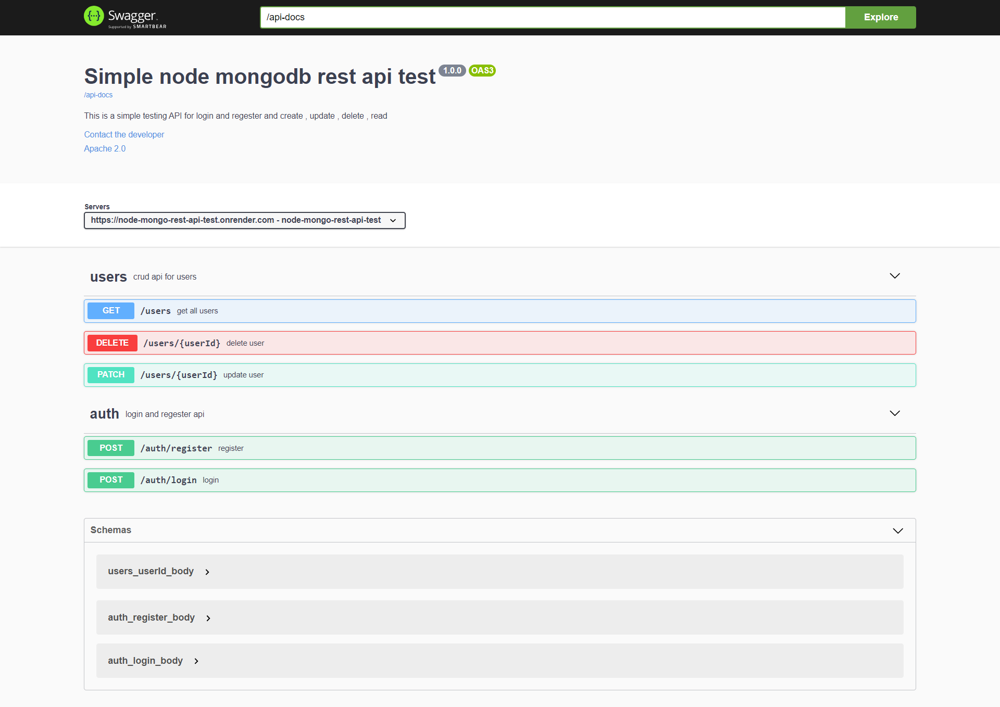

# REST API With Node, Express, TypeScript & MongoDB , only for testing

## https://node-mongo-rest-api-test-live.onrender.com/docs/

Features:

- Environment, Typescript, Nodemon setup
- MongoDB & Mongoose connect, Database creation
- Controllers creation
- Middlewares creation
- Cookie based authentication
- Postman testing
- Create, Read, Update
